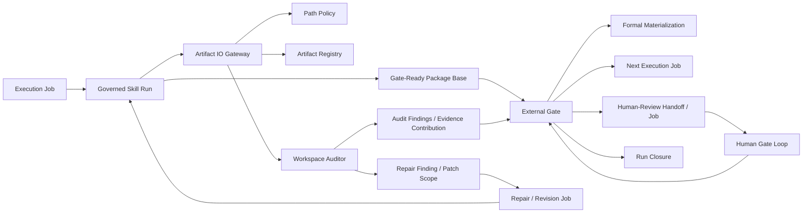
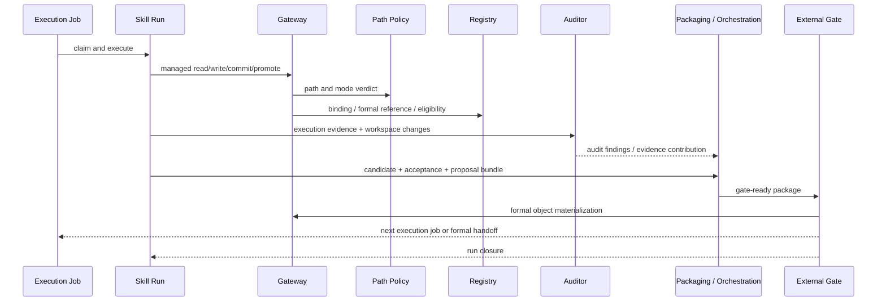
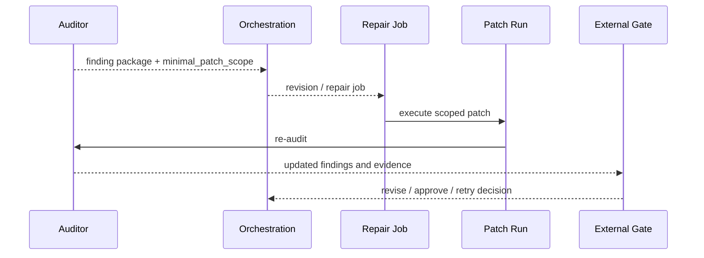
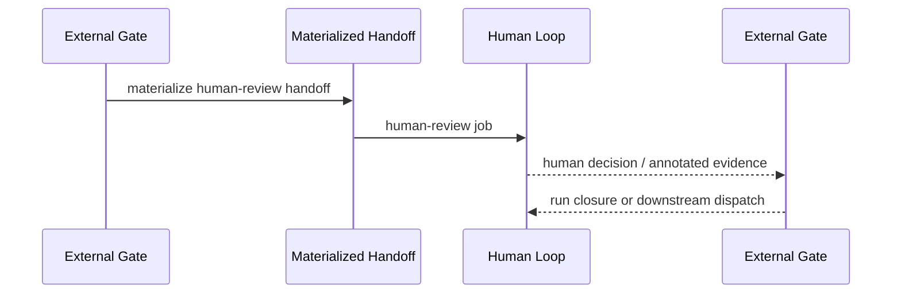

# Managed Artifact IO Governance Architecture Overview

## 文档定位

本文档描述 `SRC-001` 当前对应的系统整体蓝图，回答“系统整体长什么样、组件怎么一起工作、主链数据怎么流动、边界谁说了算”。

- 关键架构决策以 `ADR` 为准。
- 系统整体蓝图与组件关系以本文为准。
- 单组件或单能力的实现收口以 `TECH` 为准。
- 若本文与 `ADR` 冲突，以 `ADR` 为准；若本文与 `TECH` 的实现细节冲突，以 `TECH` 为准。

## 系统目标与边界

当前 LL v0.x 在这条治理链上的目标不是建设重型调度平台，而是用最小 runtime 复杂度把 `skill-first + file-handoff + dual-session dual-queue + managed artifact governance` 跑稳。

本架构当前明确是：

- `skill-first`
- `file-handoff`
- `dual-session dual-queue`
- `gate externalized`
- `validation / audit / repair first`

本架构当前明确不是：

- 重型调度器
- 完整数据库驱动状态机平台
- 长生命周期统一服务化 orchestration 中枢
- 由 skill 自己决定最终正式路径的自由文件系统

## 当前实现承载形态

`SRC-001` 当前冻结的实现承载形态是 `CLI-first + file-based runtime`。

- `Governed Skill`、`Gateway`、`Policy`、`Registry`、`Auditor`、`External Gate` 优先实现为可组合的 CLI 命令、runtime helper 与文件对象消费者，而不是先建设独立 HTTP service 或前后端平台。
- 主链状态推进依赖 `job / handoff / gate decision / evidence / materialization object` 等结构化文件对象，以及 execution loop / human gate loop / watcher 对这些对象的消费。
- `Human Gate` 在当前阶段优先通过文件对象、CLI 和 loop 提示链承载，不要求先冻结独立前端页面。
- 如后续需要补充 UI、服务化 API 或后台常驻进程，它们只能作为当前 CLI/file runtime 的派生承载层，不得改写既有对象边界、状态语义与 gate 分权。

这意味着当前实现优先级是：

1. 冻结文件对象、CLI 边界与 loop/watcher 消费规则。
2. 让主链在 `CLI + file runtime` 上跑通。
3. 再视需要补充更强的服务化或可视化承载层。

## 核心组件图

## 核心对象模型

| 对象 | 作用 | 生产者 | 消费者 |
| --- | --- | --- | --- |
| `Job` | 驱动某个 consumer 开始处理 | Gate / Orchestration | Execution loop / Gate loop / Human loop |
| `Run` | 表达一次 skill 执行实例及其状态 | Execution runtime | Auditor / Gate / Reporting |
| `Managed Artifact` | 受管正式产物 | Gateway + Registry | Downstream skill / Gate / Auditor |
| `Registry Record` | 记录 artifact identity、path、status、refs、lineage | Registry binding flow | Managed read guard / Auditor / Gate |
| `Handoff` | 跨 consumer 的正式上下文交接对象 | External Gate materialization | Human loop / special consumer |
| `Gate-Ready Package` | gate 输入包，包含 candidate、acceptance、evidence、budget 等 | Governed skill run | External Gate |
| `Audit Finding` | 结构化治理证据与修补定位 | Workspace Auditor | Repair / Gate / Supervision |
| `Repair Task` | 最小修补或 revision 的执行起点 | Audit / Gate | Execution loop |
| `Decision Result` | gate 最终决策及其 target 约束 | External Gate | Materializer / Dispatch / Closure |

说明：`Managed Artifact` 与 `Registry Record` 不是同一对象。前者是正式产物本体，后者是该产物受管身份、位置、状态与追溯关系的登记视图。

## 关键时序

### 正常执行链

这里的 `gate-ready package` 在逻辑上是组合包，而不是 Auditor 单侧产物，也不应被理解为仅由 skill 单侧独立生成。它至少组合 skill 侧 candidate / acceptance / evidence 与 audit side findings / evidence contribution。

### 最小修补链

### 人工 Gate 链

## 组件职责边界

| 组件 | 负责什么 | 不负责什么 |
| --- | --- | --- |
| `Governed Skill` | 生成 candidate package、execution evidence、proposal、gate-ready input | 最终 formal object 物化、最终 queue routing、run closure |
| `Artifact IO Gateway` | 统一 managed operation surface、receipt、fail-closed 执行 | policy authoring、identity 主键定义、审计 finding 生产 |
| `Path Policy` | 路径合法性、命名约束、mode verdict、path class | 正式写入执行、runtime state 保存、registry 登记 |
| `Artifact Registry` | identity contract、registry record、formal reference、read eligibility | 路径合法性判定、read surface 提供、审计分级 |
| `Workspace Auditor` | contract + runtime evidence 联合求值、旁路或尝试型 unmanaged consumption 识别、finding 输出 | 正式读写阻断、policy authoring、gate decision |
| `External Gate` | 消费 package completeness、acceptance、evidence 与 audit 映射，执行 decision、formal materialization、dispatch、run closure | 生成新的业务候选内容、替代上游 skill 做内容级重写、改写 acceptance 规则本身 |
| `Orchestration / Handoff Layer` | job / handoff 路由与 consumer 投递 | 重写 audit taxonomy、重做 gate decision |
| `Human Gate Loop` | 人工判断、补充上下文、审批性决策 | 直接修改上游 candidate package 为正式对象 |

## 当前强约束

- 所有正式写路径必须走 `Gateway`，失败只能 fail-closed。
- 所有 managed read 必须走 `Gateway -> Registry-backed formal reference resolution + eligibility guard`。
- `Path Policy` 是路径与 mode 的唯一政策源，`Gateway` / `Auditor` 不得自带本地白名单。
- `Registry` 负责正式读取资格判定；`Auditor` 只负责识别旁路或尝试证据，不替代主防线。
- 正式 consumer 不得以自由目录扫描替代 managed read、formal reference resolution 或 handoff binding；任何旁路读取只能作为受限辅助能力，并纳入审计。
- `proposal` 与 `materialized object` 强制分层；formal object 只能在 gate 后物化。
- `External Gate` 当前是唯一 formal materialization + dispatch + run closure 层，但这一 slice 仍受 `ADR-006` draft 状态影响。
- `Gate runtime`、`Gateway runtime` 与相关治理组件在 v0.x 阶段默认采用 `CLI-first + file runtime` 承载，除非后续 ADR 明确冻结新的默认承载方案。

## 文档体系映射

| 文档类型 | 作用 |
| --- | --- |
| `ADR` | 冻结关键架构决策与不可随意改写的原则 |
| `ARCHITECTURE` | 描述系统整体蓝图、组件关系、对象模型、时序与当前默认实现承载形态 |
| `SRC / EPIC / FEAT / TASK / RELEASE` | 定义业务与治理需求范围、拆分与交付边界 |
| `TECH` | 收口单组件或单能力的技术设计 |
| `Contract / Schema` | 定义机器可执行输入输出和结构约束 |
| `Runbook / Guide` | 说明运行、运维、排障和使用方法 |

## Architecture 到 TECH 的映射

| 架构切面 | 当前 TECH | 状态 |
| --- | --- | --- |
| Managed operation surface | `TECH-FEAT-SRC-001-001` | `active` |
| Path / mode governance | `TECH-FEAT-SRC-001-002` | `active` |
| Identity / registry / formal reference | `TECH-FEAT-SRC-001-003` | `active` |
| Runtime audit / finding model | `TECH-FEAT-SRC-001-004` | `active` |
| External gate / materialization / dispatch | `TECH-FEAT-SRC-001-005` | `provisional` |

## 当前版本状态

- `TECH-FEAT-SRC-001-001` 至 `TECH-FEAT-SRC-001-004` 对应的架构切面可作为当前 active 基线理解。
- `TECH-FEAT-SRC-001-005` 对应的 external gate 切面仍是本架构中的 provisional slice，因为 `ADR-006` 目前仍为 `Draft`。
- 因此，这份 Architecture Overview 描述的是“当前系统总装图 + 已知 provisional area”，不是宣称所有切面都已完全冻结。
