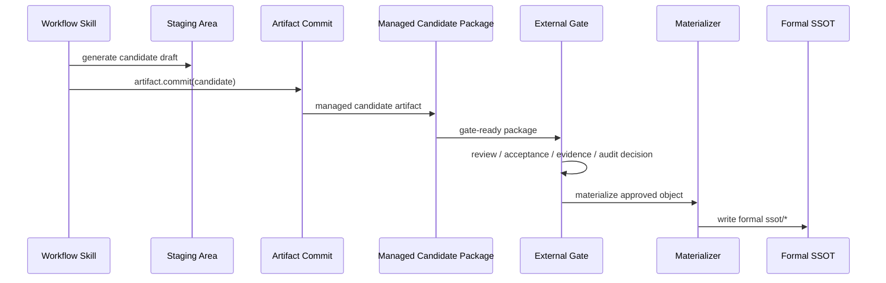

# Governed Skill Candidate and Gate Materialization Integration

## 文档定位

本文档回答一个容易在实现阶段被误解的问题：

- workflow skill 到底要不要直接写正式 `ssot/*`
- 候选包和正式对象的治理边界到底在哪里
- `artifact.commit` 应该接在 skill 侧还是 gate 侧

本文档是 [ARCH-SRC-001-001__managed-artifact-io-governance-architecture-overview.md](E:/ai/LEE-Lite-skill-first/ssot/architecture/ARCH-SRC-001-001__managed-artifact-io-governance-architecture-overview.md) 的补充说明。若与总览或 `ADR` 冲突，以总览和 `ADR` 为准。

## 核心结论

当前 `SRC-001` 链路中，workflow skill 不负责正式 `ssot/*` 物化。

- workflow skill 负责生成 `candidate package`、`review evidence`、`acceptance evidence`、`handoff proposal`、`job proposal`
- workflow skill 可以把候选主产物提交到受管 artifact 主链
- formal `ssot/*` 物化只能由 `External Gate / Materializer` 在审批通过后统一执行

因此，接入治理接口时要区分两类写入：

- `candidate governance write`
- `formal materialization write`

前者允许由 workflow skill 发起；后者只能由 gate/control 层发起。

## 集成边界

### Skill 负责什么

- 生成候选主产物，例如 `src-candidate.md`、`epic-freeze.md`、`feat-freeze-bundle.md`、`tech-design-bundle.md`
- 生成 review / acceptance / evidence / handoff proposal / job proposal
- 生成 `gate-ready package` 所需的 candidate side 内容
- 通过 `CLI/file-runtime governance API` 把候选主产物提交到受管 artifact 目录

### Skill 不负责什么

- 不直接写正式 `ssot/src`
- 不直接写正式 `ssot/epic`
- 不直接写正式 `ssot/feat`
- 不直接写正式 `ssot/tech`
- 不直接写 `materialized handoff`
- 不直接写 `materialized job`
- 不直接执行最终 `run closure`

### Gate 负责什么

- 消费 `gate-ready package`
- 合并 candidate、acceptance、evidence、audit finding 映射
- 形成 decision
- decision 通过后统一执行 formal materialization
- 物化正式 `ssot/*`
- 物化 `materialized handoff` / `materialized job`
- 写入 `run closure`

## 目录与对象分层

当前实现至少区分三层目录语义：

| 层级 | 典型位置 | 允许谁写 | 语义 |
| --- | --- | --- | --- |
| `staging` | `.workflow/runs/<run_id>/generated/...` | workflow skill / gate | 临时生成内容，不等于正式对象 |
| `managed candidate` | `artifacts/<workflow>/<run_id>/...` | workflow skill 通过治理接口写 | 受管候选包，可被 review / gate 消费 |
| `formal ssot` | `ssot/src`、`ssot/epic`、`ssot/feat`、`ssot/tech` | gate/materializer | 审批通过后的正式物化对象 |

这三层不能混用。

- `staging` 不是正式输出
- `artifacts/...` 下的候选包不是 formal object
- `ssot/...` 不能被 workflow skill 当作普通输出目录直接写入

## 推荐写入模式

### Workflow skill 侧

workflow skill 的正式接入模式应是：

1. 先在 `staging` 生成主产物文本
2. 再调用 `artifact.commit`
3. 把候选主产物写入 `artifacts/<workflow>/<run_id>/...`
4. 记录 `canonical_path`、`receipt_ref`、`registry_record_ref`

也就是：

`staging -> artifact.commit -> managed candidate`

而不是：

`generate -> direct write ssot`

### Gate 侧

gate / materializer 的正式接入模式应是：

1. 消费 `gate-ready package`
2. 形成 `decision`
3. decision 为通过性结果时再调用 formal materialization
4. 统一写入 `ssot/*`
5. 统一写 `materialized handoff`、`materialized job`、`run closure`

也就是：

`gate-ready package -> decision -> formal materialization -> ssot`

## 关键时序

这里最重要的边界是：

- skill 的提交对象是 `managed candidate package`
- gate 的提交对象才是 `formal ssot object`

## API 调用含义

在当前 `CLI-first + file-runtime` 模型中：

- workflow skill 可以调用 `tooling CLI`
- gate/control 层才可以调用 `control CLI`

因此：

- workflow skill 可以调用 `artifact.commit`
- workflow skill 不应直接调用 `gate-decision / gate-materialization / run-close`
- gate loop / watcher / control layer 才能调用最终 decision 与 materialization 命令

## 对 skill 作者的接入要求

每个 governed workflow skill 至少满足以下规则：

1. 主产物先写 `staging`，再提交到 `artifacts/<workflow>/<run_id>/...`
2. 主产物不能直接写 `ssot/*`
3. `package-manifest.json` 必须记录主产物路径与 CLI commit evidence
4. `execution-evidence.json` 必须记录 `receipt_ref`、`registry_record_ref`
5. supervisor 若会改主产物状态，也必须沿同一治理路径重提交流程
6. side artifacts 可以暂时直接写盘，但不得冒充 formal object

## 对 gate 实现者的接入要求

gate / materializer 至少满足以下规则：

1. gate 是唯一 formal `ssot/*` 写入入口
2. 未经过 decision，不得 materialize 正式对象
3. candidate package 与 formal object 必须分层
4. materialized handoff / job 只能由 gate/control 层生成
5. run closure 必须引用 decision 与 materialized refs
6. downstream consumer 消费 formal object 时，不得把 candidate package 误当正式对象

## 明确禁止的实现

- workflow skill 直接把 `candidate` 写进 `ssot/*`
- workflow skill 绕过 gate 直接写 `materialized handoff`
- workflow skill 用自由目录扫描替代 formal reference / handoff binding
- gate 直接改写业务 candidate 内容本体后再冒充原候选输出
- downstream consumer 把 `artifacts/<workflow>/<run_id>/...` 下的 candidate 路径当成 formal object 路径长期依赖

## 当前已经成立的实现策略

当前已接入治理主链的 workflow skill，应理解为：

- 它们的候选主产物已经进入受管 artifact 主链
- 这不等于它们已经获得 formal `ssot/*` 物化权
- 后续仍应把正式 SSOT 写入统一收口到 gate/materializer

因此，现阶段对 workflow skill 的接入结论应写成：

- `candidate package governance integrated`
- 而不是 `formal ssot writer integrated`

## 实施建议

对新建 workflow skill，推荐默认模板直接生成下面的集成结构：

- `*_cli_integration.py`
- `staging -> artifact.commit -> managed candidate`
- `package-manifest` 挂 CLI commit refs
- `execution-evidence` 挂 receipt / registry refs
- 明确禁止直写 `ssot/*`

对 gate/materializer，推荐优先实现：

- decision contract
- formal object materialization
- materialized handoff
- materialized job
- run closure

这样可以保证：

- skill 侧先进入受管 candidate 主链
- formal object 再由 gate 统一落盘
- 不会把 formalization 权限扩散到每个 workflow skill
